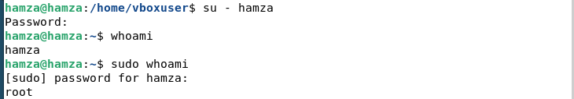
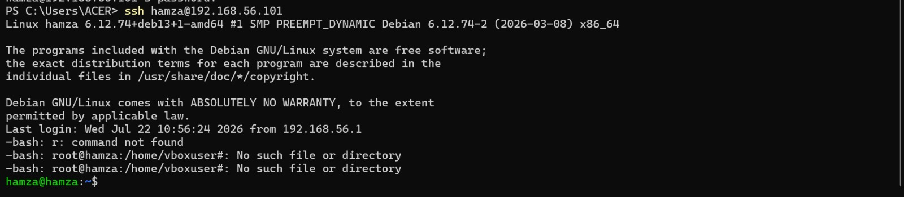
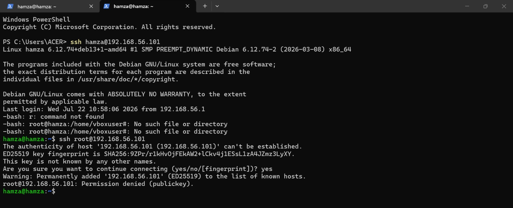
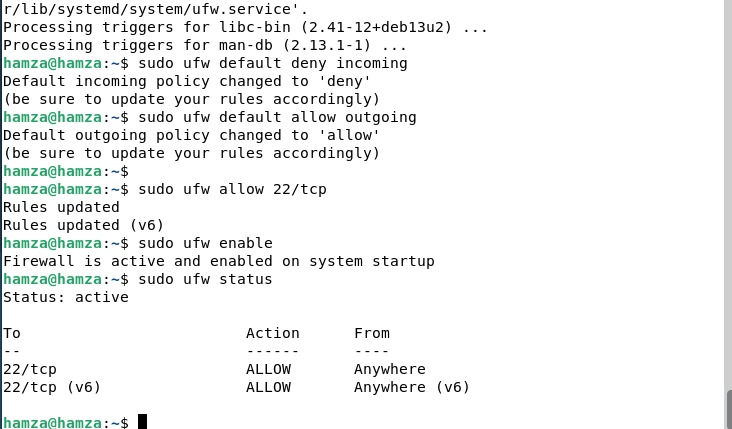
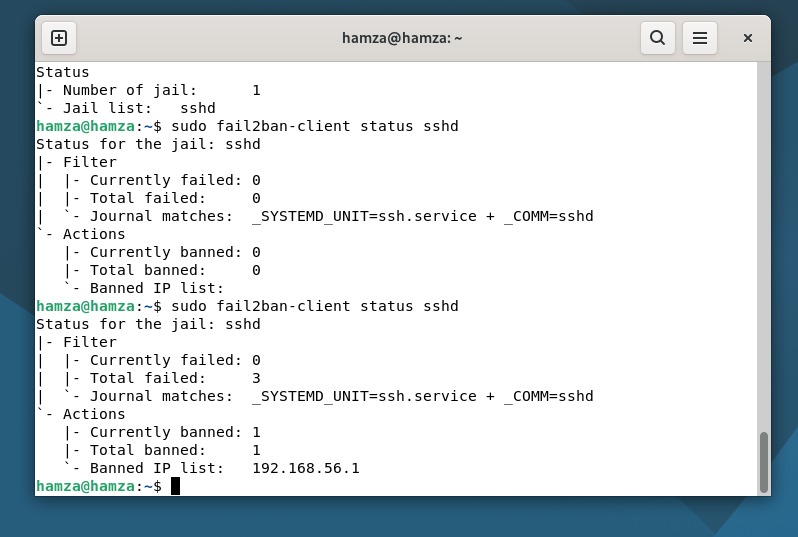
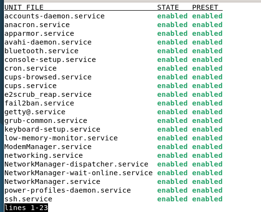
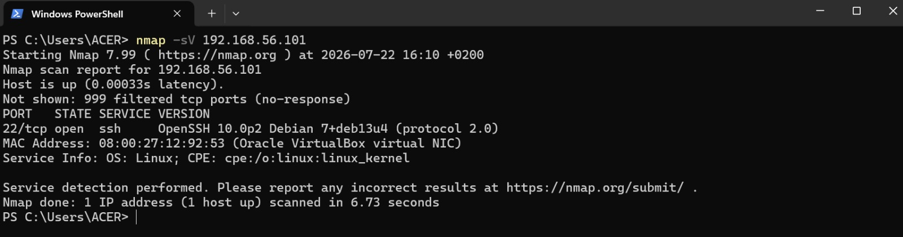

# Secure Linux Server Lab

Hardening complet d'un serveur Debian fraîchement installé, réalisé dans une VM VirtualBox, avec documentation de chaque étape et des choix effectués.

## Objectif du projet

Ce projet simule une situation réelle d'administration système : sécuriser un serveur Linux tout juste installé, comme le ferait un admin sys avant de le mettre en production. L'objectif est double :
- Mettre en place les protections de base indispensables sur tout serveur exposé (accès distant, pare-feu, détection d'intrusion, mises à jour)
- Documenter chaque choix technique et son "pourquoi", pas seulement les commandes tapées

## Environnement

- **Hyperviseur** : VirtualBox
- **Système** : Debian (installation minimale avec interface graphique GNOME)
- **Réseau** : Adaptateur NAT (par défaut) + Adaptateur Host-only (ajouté pour permettre l'accès SSH depuis la machine hôte)

---

## Étape 1 — Créer un utilisateur non-root avec sudo

### Pourquoi
Travailler en permanence avec le compte root, c'est prendre un risque inutile : ce compte a tous les droits sans aucune restriction. En cas d'erreur de manipulation ou de compromission, les dégâts possibles sont maximaux. La bonne pratique consiste à créer un utilisateur normal, qui ne peut effectuer des actions d'administration qu'en le demandant explicitement via `sudo`.

### Commandes utilisées

```bash
apt update
apt install sudo -y
adduser hamza
usermod -aG sudo hamza
```

- `apt update` : actualise la liste des paquets disponibles
- `apt install sudo -y` : installe l'utilitaire `sudo` (absent par défaut sur une install Debian minimale, contrairement à Ubuntu)
- `adduser hamza` : crée le nouvel utilisateur avec son dossier personnel et son mot de passe
- `usermod -aG sudo hamza` : ajoute l'utilisateur au groupe `sudo`, lui donnant le droit d'exécuter des commandes d'administration

### Vérification

```bash
su - hamza
sudo whoami
```

Résultat attendu : `root` — preuve que l'utilisateur a bien les droits sudo, tout en étant connecté sous son propre nom.



### Problème rencontré et résolu
Le PATH du système ne contenait pas `/usr/sbin` ni `/sbin`, empêchant l'exécution directe de commandes comme `adduser` ou `usermod`. Corrigé en ajoutant la ligne suivante dans `~/.bashrc` :

```bash
export PATH="/usr/local/sbin:/usr/sbin:/sbin:$PATH"
```

---

## Étape 2 — Installer SSH et identifier l'adresse IP de la VM

### Pourquoi
Un serveur réel n'est jamais administré physiquement — on s'y connecte toujours à distance via SSH (Secure Shell). Cette étape simule cette situation : la VM devient "le serveur", le PC hôte devient "le poste de l'administrateur".

### Commandes utilisées

```bash
sudo apt install openssh-server -y
sudo systemctl status ssh
ip a
```

- `openssh-server` : installe le service qui écoute les connexions SSH entrantes
- `systemctl status ssh` : vérifie que le service tourne bien (`active (running)`)
- `ip a` : affiche les interfaces réseau et leurs adresses IP

### Résultat
IP identifiée sur l'interface NAT par défaut : `10.0.2.15` (non joignable depuis l'hôte — voir problème réseau ci-dessous).

---

## Étape 3 — Authentification SSH par clé

### Pourquoi
Une clé SSH remplace avantageusement un mot de passe : elle se compose d'une paire de fichiers, une clé **privée** (jamais partagée, reste sur la machine cliente) et une clé **publique** (déposée sur le serveur). Seul le possesseur de la clé privée correspondante peut se connecter — impossible à deviner, impossible à forcer par tentatives répétées, contrairement à un mot de passe.

### Commandes utilisées (sur la machine hôte, PowerShell)

```powershell
ssh-keygen -t ed25519 -C "labo-debian"
```
Génère la paire de clés (`id_ed25519` et `id_ed25519.pub`) dans `~/.ssh/`.

```powershell
type $env:USERPROFILE\.ssh\id_ed25519.pub | ssh hamza@192.168.56.101 "mkdir -p ~/.ssh && cat >> ~/.ssh/authorized_keys"
```
Copie la clé publique dans le fichier `authorized_keys` de la VM, autorisant ainsi cette clé à se connecter.

### Vérification

```powershell
ssh hamza@192.168.56.101
```
Résultat attendu : connexion immédiate, **sans aucune demande de mot de passe**.



### Problème réseau rencontré et résolu
L'adresse IP par défaut (`10.0.2.15`, mode NAT) n'était pas joignable depuis la machine hôte — erreur `Connection timed out`. Résolu en ajoutant un second adaptateur réseau en mode **Host-only** dans les paramètres VirtualBox de la VM, ce qui a fourni une nouvelle adresse IP accessible : `192.168.56.101`.

---

## Étape 4 — Verrouiller SSH (bloquer root, désactiver le mot de passe)

### Pourquoi
Une fois la connexion par clé fonctionnelle, il reste deux failles à fermer :
- **Le compte root reste accessible en SSH** : c'est une cible évidente, son nom est toujours le même sur tous les systèmes Linux
- **Le mot de passe reste une option de connexion valide** : vulnérable aux attaques par force brute (essais automatisés de milliers de combinaisons)

En désactivant les deux, seule la clé privée présente sur la machine autorisée peut ouvrir un accès.

### Fichier modifié : `/etc/ssh/sshd_config`

```bash
sudo nano /etc/ssh/sshd_config
```

Lignes modifiées :
```
PermitRootLogin no
PasswordAuthentication no
```

- `PermitRootLogin no` : interdit toute connexion SSH directe avec le compte root
- `PasswordAuthentication no` : interdit toute authentification par mot de passe, pour tous les utilisateurs

### Application des changements

```bash
sudo systemctl restart ssh
```

### Vérification

Test que la connexion par clé fonctionne toujours (`hamza`) :
```powershell
ssh hamza@192.168.56.101
```

Test que root est bien bloqué :
```powershell
ssh root@192.168.56.101
```
Résultat attendu : `Permission denied (publickey)`.



---

## Étape 5 — UFW (pare-feu)

### Pourquoi
Jusqu'ici, l'accès SSH est sécurisé, mais rien ne contrôle encore quels ports du serveur sont accessibles depuis l'extérieur. Chaque port ouvert représente une porte d'entrée potentielle. **UFW** (Uncomplicated Firewall) permet d'appliquer une règle simple et stricte : tout le trafic entrant est bloqué par défaut, sauf ce qui est explicitement autorisé.

### Commandes utilisées

```bash
sudo apt install ufw -y
sudo ufw default deny incoming
sudo ufw default allow outgoing
sudo ufw allow 22/tcp
sudo ufw enable
```

- `default deny incoming` : bloque tout trafic entrant par défaut
- `default allow outgoing` : autorise le trafic sortant (mises à jour, accès internet)
- `allow 22/tcp` : autorise spécifiquement le port SSH — **toujours avant** l'activation du pare-feu, pour ne pas se bloquer soi-même
- `enable` : active le pare-feu avec les règles définies

### Vérification

```bash
sudo ufw status
```



### Problème DNS rencontré et résolu
L'installation d'UFW a d'abord échoué à cause d'une résolution DNS défaillante (le service `dhcpcd` régénérait `/etc/resolv.conf` en effaçant les DNS ajoutés manuellement). Résolu en ajoutant le serveur DNS dans le fichier modèle persistant `/etc/resolv.conf.head` :

```bash
sudo nano /etc/resolv.conf.head
```
```
nameserver 8.8.8.8
```

---

## Étape 6 — Fail2ban

### Pourquoi
Même avec SSH verrouillé et le pare-feu actif, un attaquant peut toujours tenter de se connecter en boucle. **Fail2ban** surveille les journaux de connexion et bannit automatiquement l'adresse IP d'un attaquant après un certain nombre de tentatives échouées, pour une durée définie.

### Configuration : `/etc/fail2ban/jail.local`

```bash
sudo nano /etc/fail2ban/jail.local
```

```ini
[sshd]
enabled = true
port = 22
maxretry = 3
bantime = 600
findtime = 600
```

- `maxretry = 3` : bannissement après 3 tentatives échouées
- `findtime = 600` : fenêtre de temps de 10 minutes pour compter les échecs
- `bantime = 600` : durée du bannissement, 10 minutes

### Application

```bash
sudo systemctl restart fail2ban
sudo systemctl enable fail2ban
```

### Test réalisé

3 tentatives de connexion volontairement échouées depuis la machine hôte :
```powershell
ssh fakeuser@192.168.56.101
```
(répété 3-4 fois)

Vérification :
```bash
sudo fail2ban-client status sshd
```

Résultat obtenu : `Currently banned: 1`, avec l'IP de la machine hôte bannie automatiquement après les tentatives échouées.



---

## Étape 7 — Mises à jour automatiques de sécurité

### Pourquoi
Des vulnérabilités sont régulièrement découvertes dans les logiciels systèmes. Sans mises à jour régulières, ces failles restent exploitables indéfiniment, même avec un pare-feu et une détection d'intrusion en place. **unattended-upgrades** installe automatiquement les correctifs de sécurité, sans intervention manuelle.

### Commandes utilisées

```bash
sudo apt install unattended-upgrades -y
sudo dpkg-reconfigure --priority=low unattended-upgrades
```

### Vérification

```bash
cat /etc/apt/apt.conf.d/20auto-upgrades
```

Résultat attendu :
```
APT::Periodic::Update-Package-Lists "1";
APT::Periodic::Unattended-Upgrade "1";
```

---

### Audit et désactivation des services inutiles

### Pourquoi
Chaque service actif en arrière-plan représente une surface d'attaque potentielle, même minime. Le principe du **moindre privilège** consiste à ne garder actif que le strict nécessaire au fonctionnement du serveur.

### Commande d'audit

```bash
systemctl list-unit-files --type=service --state=enabled
```

Cette commande liste tous les services configurés pour démarrer automatiquement avec le système.

### Services identifiés comme inutiles et désactivés

| Service | Rôle | Raison de la désactivation |
|---|---|---|
| `avahi-daemon` | Découverte automatique d'appareils réseau | Inutile sur un serveur |
| `bluetooth` | Gestion Bluetooth | Aucun matériel Bluetooth sur une VM |
| `cups` / `cups-browsed` | Système d'impression | Aucune imprimante sur un serveur |
| `ModemManager` | Gestion des modems 3G/4G | Aucun modem sur une VM |
| `low-memory-monitor` | Surveillance mémoire (environnement desktop) | Pertinent uniquement avec interface graphique active en continu |
| `power-profiles-daemon` | Gestion des profils d'énergie | Inutile sur un serveur/VM toujours branché |

### Commandes de désactivation

```bash
sudo systemctl disable --now avahi-daemon
sudo systemctl disable --now bluetooth
sudo systemctl disable --now cups
sudo systemctl disable --now cups-browsed
sudo systemctl disable --now ModemManager
sudo systemctl disable --now low-memory-monitor
sudo systemctl disable --now power-profiles-daemon
```

- `disable` : empêche le démarrage automatique au prochain redémarrage
- `--now` : arrête aussi le service immédiatement

### Vérification

```bash
systemctl list-unit-files --type=service --state=enabled
```

Les 7 services ciblés n'apparaissent plus dans la liste des services actifs, confirmant leur désactivation. Les services essentiels (SSH, UFW, Fail2ban, cron, réseau, apparmor) restent bien actifs.

---


## Test final — Scan nmap

### Pourquoi
Un scan `nmap` depuis la machine hôte simule ce qu'un attaquant verrait en scannant le serveur de l'extérieur. C'est la validation finale de l'ensemble du hardening réseau effectué.

### Commande utilisée (depuis la machine hôte)

```powershell
nmap -sV 192.168.56.101
```

### Résultat

```
Not shown: 999 filtered tcp ports (no-response)
PORT   STATE SERVICE VERSION
22/tcp open  ssh    OpenSSH 10.0p2 Debian
```

Sur 1000 ports scannés, un seul est ouvert : le port 22 (SSH). Les 999 autres sont filtrés par UFW — confirmation concrète que le pare-feu fonctionne comme prévu et que la surface d'attaque exposée du serveur est réduite au strict minimum.



---

## Ce que j'ai appris

**Compétences techniques :**
- Gestion des utilisateurs et permissions Linux (`sudo`, groupes)
- Authentification par clé publique/privée SSH
- Configuration d'un pare-feu selon le principe "tout bloquer par défaut"
- Détection et blocage automatique de comportements suspects (Fail2ban)
- Automatisation des mises à jour de sécurité
- Réduction de la surface d'attaque via l'audit des services actifs
- Diagnostic et résolution de problèmes réseau (DNS, modes NAT vs Host-only, PATH système)

**Compétences transversales :**
- Documentation technique claire, avec justification des choix effectués
- Méthodologie de test (vérifier chaque changement avant de passer au suivant)
- Persévérance dans le débogage (problèmes réseau, DNS, clavier rencontrés et résolus un par un)

---

## Structure du dépôt

```
secure-linux-server-lab/
├── README.md
└── screenshots/
    ├── 01-sudo-check.png
    ├── 02-ssh-key-login.png
    ├── 03-root-login-blocked.png
    ├── 04-ufw-status.png
    ├── 05-fail2ban-banned.png
    ├── 06-nmap-scan.png
    └── 07-services-audit.png
```
